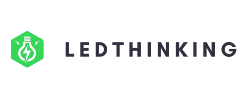

[pt-BR](readme.pt-BR.md) | en-EN

At the forefront of the digital revolution, ledthinking understands that truly disruptive innovation happens when barriers are broken down and minds come together. Our philosophy is grounded in the power of open source, acknowledging that together we can achieve more than individually.

With a team of dedicated technology experts, we offer innovative and open solutions that empower our clients to thrive in an increasingly digital world. We partner with organizations of all sizes, helping them become more efficient, agile, and future-ready through the use of open-source technology.

At ledthinking, our commitment to open source goes beyond software development. We strive to create an ecosystem where collaboration and idea sharing are valued, fostering a culture of open innovation that transcends boundaries.

Our aim is to be a driving force in digital transformation, facilitating access to cutting-edge technology solutions, and creating a lasting impact on the way businesses operate and innovate.
